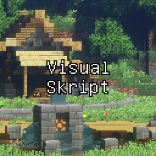
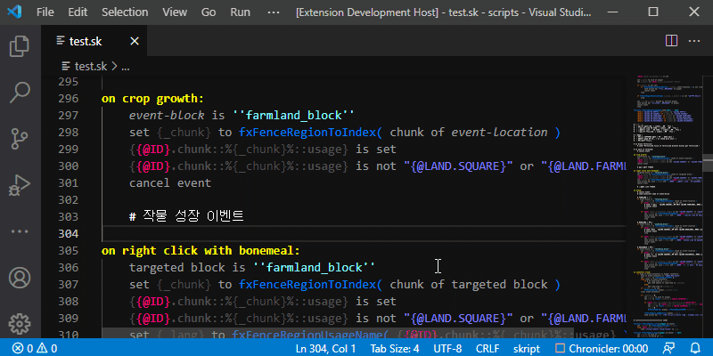
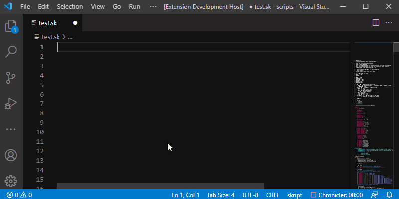
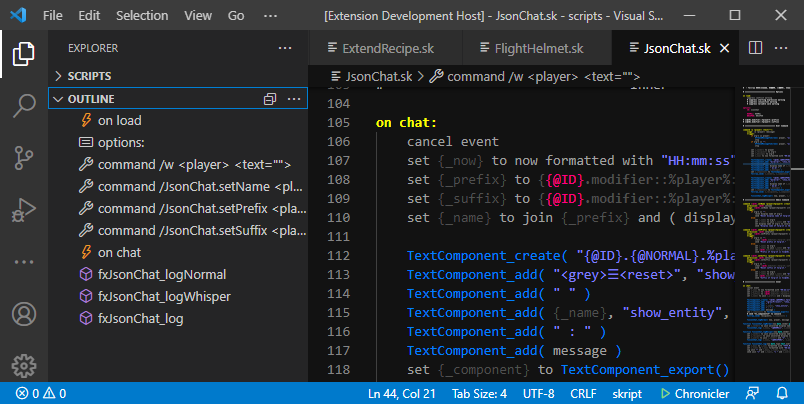
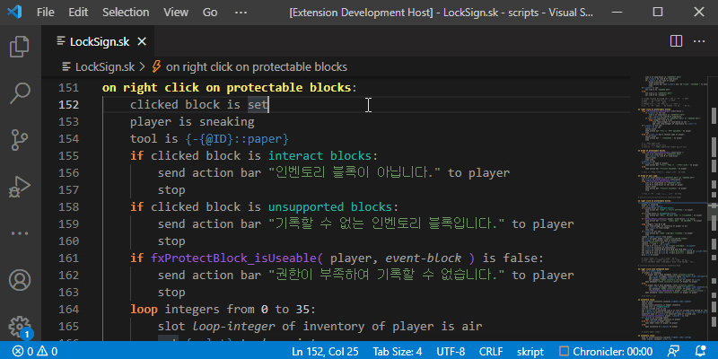
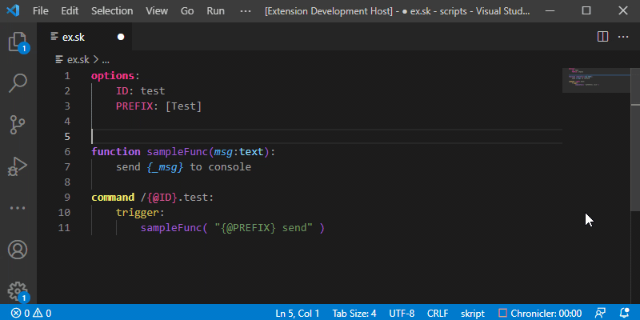
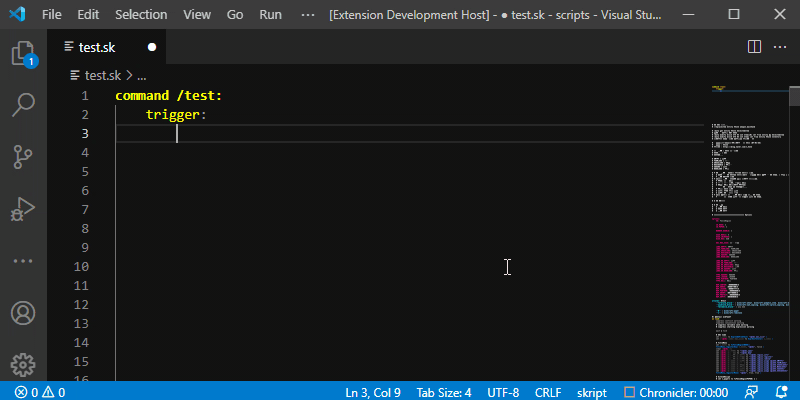
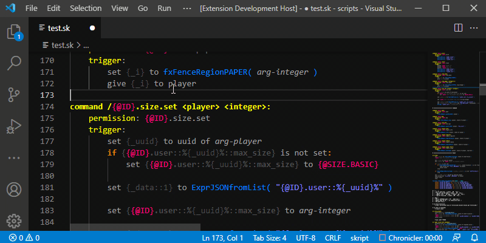
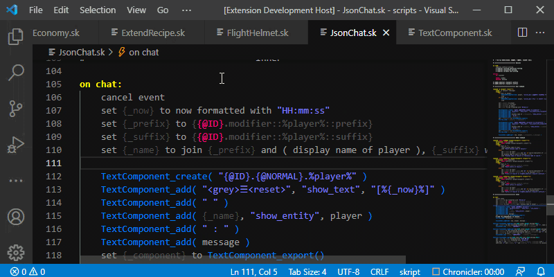

 

# VSkript 
VSkript는 마인크래프트(JE)의 Skript 플러그인을 위한 익스텐션입니다.  
스크립트의 함수를 보다 편리하게 사용하기 위해서 제작되었습니다.   

작업공간은 반드시 'skripts' 폴더로 해야합니다.   
vscode에서 작업공간을 준비 할 때 활성화된 모든 스크립트 파일을 읽습니다.   
비활성 된 스크립트는 코드 하이라이트를 제외한 대부분의 기능이 동작하지 않습니다.   

익스텐션에 대한 피드백은 [[Github](https://github.com/vhone/vskript)]로 보내주세요.  
 
VSskript is an extension for Minecraft(JE)'s Skript plug-in.   
It is designed to use the Function of the Skript more conveniently.   

The workspace must be in the 'scripts' folder. (plugins\scripts\scripts)   
When vscode prepares the workspace, it reads all the script files that are active.   
Disabled scripts do not work most of the functions except code highlighting.   

Please send feedback on extensions to [[Github](https://github.com/vhone/vskript)].   
    
 

# Update v0.0.7
[#1](https://github.com/vhone/vskript/issues/1), [#2](https://github.com/vhone/vskript/issues/1)를 참고하여 구문 강조를 업데이트 했습니다. 감사합니다.   
자세한 내용은 [[업데이트 내역](RELEASE_KO.md)]을 확인해주세요.   
 
The syntax Highlight was updated with reference to [#1](https://github.com/vhone/vskript/issues/1) and [#2](https://github.com/vhone/vskript/issues/1). Thank you.   
Please check [[Update History](RELEASE_EN.md)] for detailed updates.   
    
 

# 기능 (Features)
1. 코드 하이라이트 (Code Highlight)  
	
	- 일부 패턴에서 코드 하이라이트가 깨질 수 있습니다.  
	- Code highlights can be broken in some patterns.
	  
2. 컬러 미리보기 (Color Provider)  
	
	- '<##000000>' 형태의 헥사코드에 마우스 커서를 올리면 컬러 피커가 나타납니다.   
	피커를 사용하여 핵사코드를 변경할 수 있습니다.   
	- A color picker appears when you place the mouse cursor over the '<##000000>'.   
	You can change the hexcode using the color picker.
	  
3. 아웃라인 (OutLine)  
	
	- Options, Aliases, Command, Event, Function이 아웃라인에 등록됩니다.  
	때때로 구문 분석을 실패하면 아웃라인에 등록되지 않을 수 있습니다. (버그입니다...)
	- Options, Aliases, Command, Event, and Function are registered in the outline.   
	Sometimes if parsing fails, it may not be registered in the outline. (This is a bug...)
	  
4. 툴팁 (Tootip)  
	
	- Option, Alias, Function에 마우스 커서를 올리면 툴팁이 표시됩니다.   
	Function은 docs를 사용하여 추가적인 정보를 기입할 수 있습니다.
	- Tooltips are displayed when you hover your mouse cursor over Option, Alias, or Function.   
	Functions can fill in additional information using docs.
	  
5. 함수 확장 (Function Extensions)   
    - 함수 문서 (Function Docs)  
		
		- Docs 주석은 주석'#' 뒤에 꺽쇠'>'를 붙인 것을 머릿말로 합니다.   
		함수 윗쪽에 '#>>' 입력 후 Enter를 하면 함수 Docs가 생성됩니다.   
		Docs 주석은 MarkDown을 사용하여 함수의 툴팁을 작성할 수 있습니다.   
		함수 이름에 마우스 커서를 올리면 문서에서 정의한 툴팁을 볼 수 있습니다.   
		- Docs comments are prefixed by a comment '#' followed by an angle bracket '>'.   
		If you type '#>>' at the top of the function and press Enter, the function Docs is created.   
		Docs annotations can use MarkDown to write tooltips for functions.   
		Hover over the function name to see the tooltip defined in the documentation.
		  
	- 자동완성 (Completion)   
		
		- 단축키(Ctrl+Space)로 함수 자동완성 목록을 사용 할 수 있습니다. (완성된 기능이 아닙니다.)   
		- You can use the function auto-completion list with a shortcut key (Ctrl+Space). (This is not a finished function.)
	      
	- 심볼 검색 (Symbol Search)
		   
		- 단축키(Ctrl + T)를 사용해 모든 문서의 스크립트 요소를 검색 할 수 있습니다.   
		단축키(Ctrl + Shift + .)를 사용해 현재 열린 문서의 스크립트 요소를 검색 할 수 있습니다.   
		Docs 주석에 @invisible을 추가하면 검색을 차단합니다.   
		검색 차단은 Aliases, Options, Command, Event, Function에 적용 됩니다.   
		검색 차단된 함수는 자동완성에도 표시되지 않습니다.
		- You can search for script elements in any document using the shortcut (Ctrl + T).   
		You can search for script elements in the currently open document using the shortcut (Ctrl + Shift + .).   
		Adding @invisible to the Docs comment blocks the search.   
		Search blocking applies to Aliases, Options, Command, Event, and Function.   
		Search blocked elements are not displayed in autocomplete.
		  
	- 바로가기 (go to Definition)   
		
		- Ctrl + 좌클릭으로 함수가 정의된 페이지로 이동 할 수 있습니다.   
		문자 커서가 함수 위에 있을 때 단축키(F12)를 눌러 함수가 정의된 페이지로 이동 할 수 있습니다.   
		- You can move to the page where the function is defined with Ctrl + left click.   
		You can navigate to the page where the function is defined by pressing the hotkey (F12) when the text cursor is over the function.