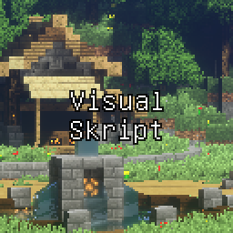
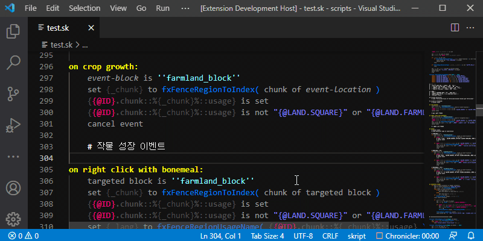
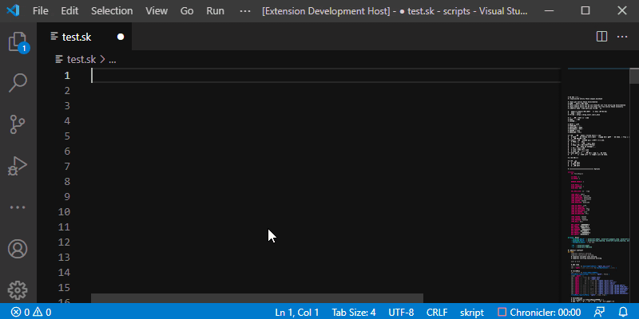
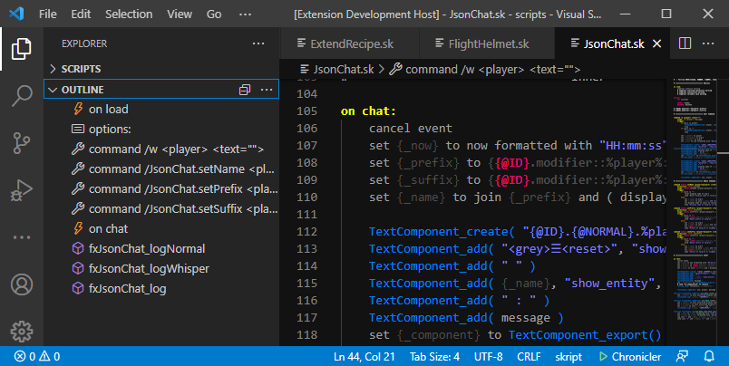
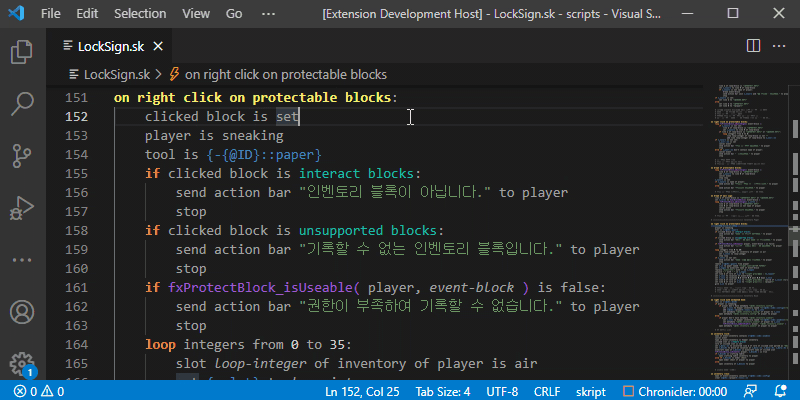
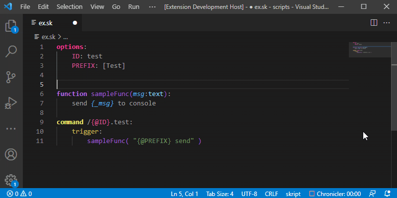
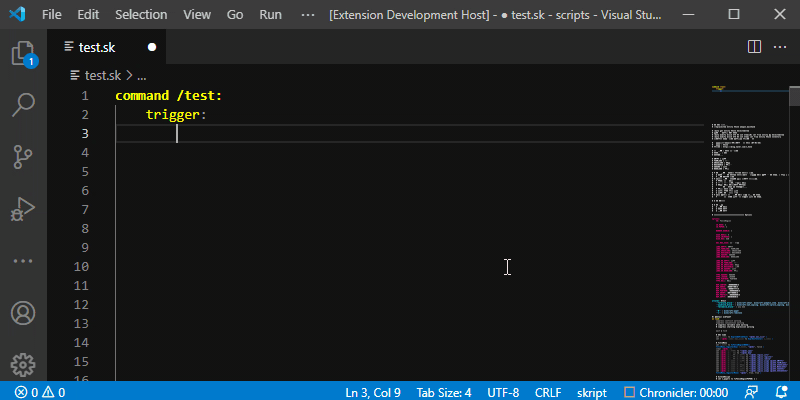
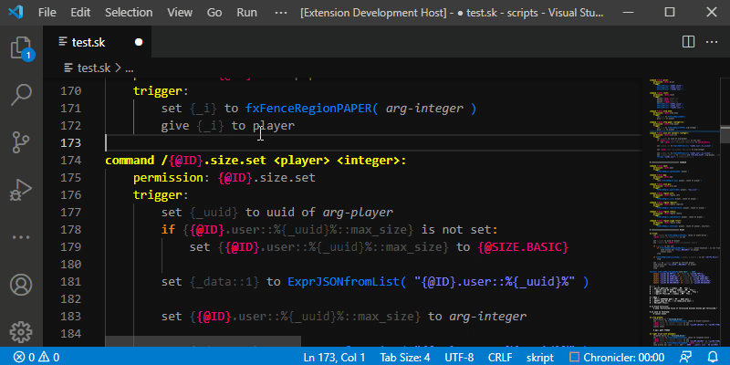
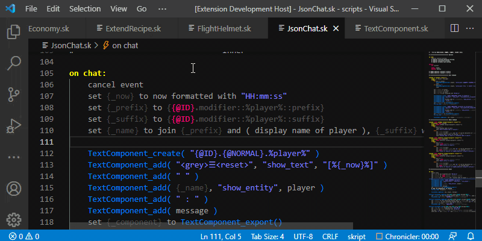

 

# VSkript 
VSkript는 마인크래프트(JE)의 Skript플러그인을 위한 Extension입니다.  

주요 기능은 함수의 확장입니다.  
skripts 폴더에 저장된 사용가능한 모든 스크립트 문서에서 함수를 읽습니다.  
함수 툴팁, 정의된 페이지로 바로가기 등 편리한 기능을 제공합니다.

익스텐션에 대한 피드백은 아래의 링크로 보내주세요.  
[[마켓플레이스 Q&A](https://marketplace.visualstudio.com/items?itemName=Vhone.vskript&ssr=false#qna)],
[[네이버 블로그](https://blog.naver.com/v_hone/222386247124)]

 

# 기능 (Features)
1. 코드 하이라이트 (Code Highlight)  
	
	- 일부 패턴에서 코드 하이라이트가 깨질 수 있습니다.  
	  
2. 컬러 미리보기 (Color Provider)  
	
	- '<##000000>' 형태의 헥사코드에 마우스 커서를 올리면 피커가 나타납니다.
	- 피커를 사용하여 핵사코드를 변경할 수 있습니다.  
	  
3. 아웃라인 (OutLine)  
	
	- Options, Aliases, Command, Event, Function이 아웃라인에 등록됩니다.  
	  
4. 툴팁 (Tootip)  
	
	- Option과 Alias에 마우스 커서를 올리면 값을 툴팁으로 표시합니다.
	- Option은 아웃라인 패널에서 변수가 아닌 값으로 표시됩니다.
	  
5. 함수 확장 (Function Extensions)
    - 문서 (Docs)  

		- 함수 위에 '#>'를 입력하면 '#> DOCS'로 변경됩니다.
		- 그대로 Enter를 입력하면 함수 설명에 필요한 요소들이 생성됩니다.
		- MarkDown으로 함수의 툴팁을 작성할 수 있습니다.
   		- 함수에 마우스 커서를 올리면 문서에서 정의한 툴팁을 볼 수 있습니다.    
		 
	- 자동완성 (Completion)

		- 단축키(Ctrl+Space)로 함수 자동완성 목록을 사용 할 수 있습니다.
		 
	- 심볼 (Symbol)

		- 단축키(Ctrl + T)를 사용해 모든 문서의 스크립트 요소를 검색 할 수 있습니다.
		- 단축키(Ctrl + Shift + .)를 사용해 현재 열린 문서의 스크립트 요소를 검색 할 수 있습니다.   
		 
	- 바로가기 (go to Definition)

		- Ctrl + 좌클릭으로 함수가 정의된 페이지로 이동 할 수 있습니다.
		- 문자 커서가 함수 위에 있을 때 단축키(F12)를 눌러 함수가 정의된 페이지로 이동 할 수 있습니다.
